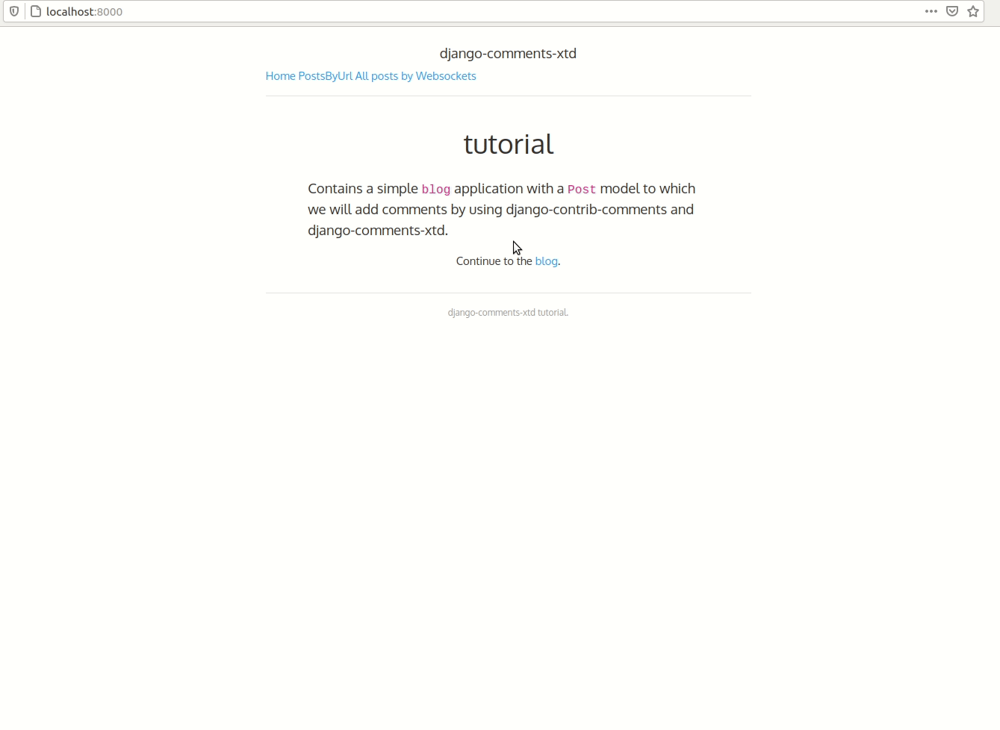

#This is attempt to implement django-sockpuppet (reflexes) in django project to see how it works using websockets where its possible. 

##Finally it would be nice to use django-sockpuppet (reflexes) everywhere in the project, to get fully SPA application.

##So that everywhere in the project we use websockets to communicate to the server and render any page of the application at once.

Django works with REFLEXES: NOTE, URL IS THE SAME: localhost:8000

Django works with URL:  NOTE URL IS working as usual.

### To run this project you have to set up python and nodejs virtual enviroments.
One of good choises for managing virtual enviromens is Miniconda.
It supports having isolated python as well as nodejs enviroments. 
- Install miniconda on your Linux machine.
- Create conda environment from file: `conda env create -f environment.yml`
- Clone the repo: `git clone https://github.com/jonndoe/django-comments-xtd-sockpuppet.git`
- Go to dir `cd django-comments-xtd-sockpuppet`
- Activate virtual environment: `conda activate env38_python_nodejs`
- Check python version: `python --version`
- Check nodejs version: `node --version`

Now you can install all required nodejs dependencies for the project (node_modules):

- `npm install`

Now you have single working isolated environment for developing application with both django and nodejs.

Webpack is configured to build static only. Django takes this static from `static` dir and servers it itself.
`/assets/app.js` is Webpack entrypoint.

### Notes about django-sockpuppet:

 - Whatever django template you trigger any server-reflex's method from,  this method will try to invoke the view, which corresponds to that template.
   For example: You have showpostsReflex#render, and you have showpostsView for this reflex method. Also you have template showposts.html. If you make
   a link to trigger this showpostsReflex#render method from inside a showposts.html template, it will happily work. But if you want to trigger that 
   showpostsReflex#render method from lets say home.html, it will fail, and will try to invoke another view, which is associated with home.html.

### README.md filling up is in progress......

##TO DO:
- Configure `webpack.conf.js` also to build assets from `./blog/javascript` , now you have to include it into `./assets/app.js` to get it done. 

